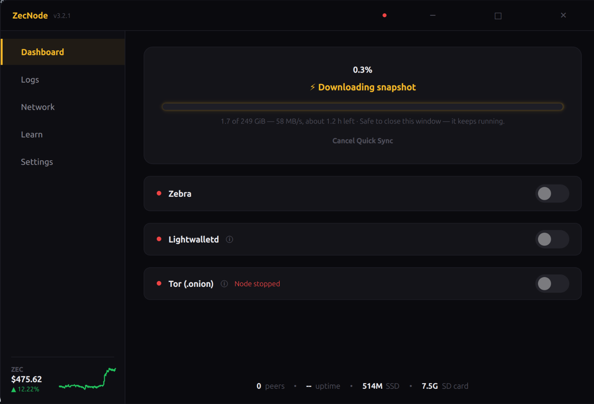

# ZecNode

Run a Zcash node in only 2 commands!


## Disclaimer

ZecNode is an independent community project and is not affiliated with, endorsed by, or associated with the Electric Coin Company, Zcash Foundation, or any official Zcash organization.

## What is this?

A GUI installer and dashboard for running a Zcash full node. I built it because setting up a node manually is tedious - you have to install Docker, format drives, edit config files, etc. Even more tedious if you don't use Docker. This handles all of that.

## Why a Raspberry Pi?

Running a node on your main computer kind of sucks. It eats up resources, needs to stay on 24/7, and uses way more electricity than necessary. A Pi 5 with an SSD runs the full Zcash blockchain for like $5/year in electricity, sits in a corner, and just works. Set it and forget it.

## Install

> **Update your system first.** ZecNode doesn't upgrade your packages for you — that's your machine and your call — so please run a quick system update *before* installing. It avoids dependency hiccups and is the smoothest path:
>
> ```bash
> sudo apt update && sudo apt upgrade -y
> ```
>
> Reboot if it pulls in a new kernel, then continue below.

**1.** Open a terminal and run:

```bash
sudo apt install curl -y && curl -sSL https://raw.githubusercontent.com/mycousiinvinny/zecnode/main/install.sh | bash
```

**2.** The installer reboots once after installing Docker. When it comes back, run this to finish:

```bash
curl -sSL https://raw.githubusercontent.com/mycousiinvinny/zecnode/main/install.sh | bash
```

Please report any bugs you find. Enjoy!

## Requirements

- Raspberry Pi 5 (recommended) or any Linux PC
- External SSD (500GB minimum)
- Internet connection
- A few minutes for the ZecNode setup itself. The full chain then syncs in the background, which takes a while (hours to days, depending on your connection) — you can use everything while it syncs.

## What it does

- Installs Docker and Zebra (Zcash node software)
- Formats and mounts your SSD
- Shows sync progress, peer count, disk usage
- Runs in the system tray
- **Web dashboard** for headless setups — manage and monitor your node from any browser on your network
- Notifies you when a new version is available, and updates in one click
- Restarts automatically after reboots or power outages
- Built-in **Learn** tab explaining the tech behind Zcash in plain English
- Optional **Tor** support — share your node over a private `.onion` address

## Connect privately over Tor (.onion)

ZecNode can expose your node over Tor as a `.onion` address, so wallets can connect **without ever revealing their IP to your server**. It's an opt-in toggle in Settings (and in the web dashboard) — flip it on and your node gets a permanent `.onion` address.

### Connecting a wallet to it

A `.onion` can only be reached *through* Tor, so the wallet needs a Tor path:

1. Install **Orbot** (the Tor app) on the phone and turn on its VPN mode — or use a wallet that has Tor built in.
2. In the wallet's server settings, point lightwalletd at your address:
   `http://<your-node>.onion:443`
   Use `http`, not `https` — Tor already encrypts the connection end-to-end, so no TLS is needed.
3. Sync. The wallet now talks to your node entirely over Tor.

> **Tip:** On the desktop dashboard, click **QR** next to your `.onion` to scan the address straight into your phone — no typing 56 characters.

Your normal (clearnet) wallet access keeps working unchanged — Tor is just an extra private door.

## Screenshot



## Why run a node?

More nodes = more decentralization = stronger network. That's it.

## Start the node over from scratch

If your node ever gets stuck or corrupt and you just want a clean re-sync, you can delete the blockchain and let it re-download. Your ZecNode install and SSD setup stay intact — only the (re-downloadable) chain data is removed.

```bash
# Stop and remove the node containers (lightwalletd/arti may not exist — that's fine)
docker rm -f zebra lightwalletd arti 2>/dev/null

# Delete the blockchain data so it re-syncs from scratch
sudo rm -rf /mnt/zebra-data/zebra-cache/* /mnt/zebra-data/zebra-state/* /mnt/zebra-data/lightwalletd/*
```

Then reopen ZecNode — it rebuilds the containers and starts syncing again. A full re-sync takes a while (the chain is large), so only do this if the node is actually broken.

## Uninstall

Download and run the uninstaller:

```bash
curl -sSL https://raw.githubusercontent.com/mycousiinvinny/zecnode/main/uninstall.sh -o uninstall.sh
bash uninstall.sh
```

This removes the app, config, and containers. Your blockchain data at `/mnt/zebra-data` is **preserved**, so reinstalling is near-instant.

### Full wipe — start completely from scratch

To also erase **all blockchain data on the SSD** for a truly fresh start, add `--wipe`:

```bash
bash uninstall.sh --wipe
```

It stops everything, removes the app and config, and erases the SSD — asking you to type `ERASE` to confirm first. You'll have to sync the node from scratch afterward, so only use this when you genuinely want a clean slate.

## Roadmap

- Mac version coming eventually
- Windows version coming eventually


